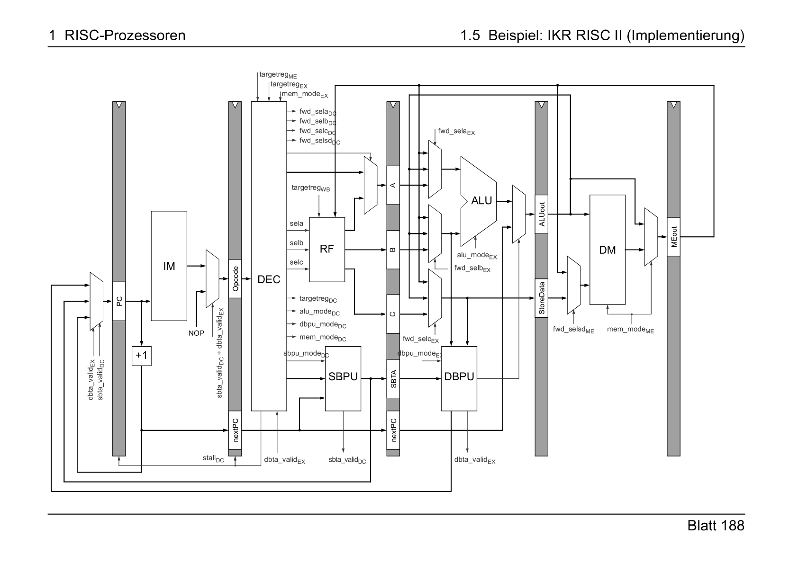

# IKR RISC II Project
During the wintersemester 21/22 my fellow student Kenton and myself designed a RISC processor in VHDL. The architecture is based on the IKR RISC II of the Institute of Communication Networks and Computer Engineering at University of Stuttgart.
It follows the classic five stage RISC pipeline but implements a different ISA and does only allow word-adressable instead of byte-adressable memory.

## About this Repo
We submitted the project in July 2022 with a synthesizable 5 stage pipeline including fowarding and branch-functionalities. We testet and validated our design on a Terasic Cyclone V development board.

More details on the architecture will follow

## About this Project
The following chapters will give a brief overview about the projects and its resources. 

### Pipeline
A simplified schematic of the implemented pipeline is shown below:

The graphic was provided with the kind permission of Dipl.-Ing. Mattias Meyer - Lecture script "Rechnerarchitektur und Rechnerorganisation", Wintersemester 2021/22, University of Stuttgart, Institute of Communication Networks and Computer Engineering (IKR).

So far we implemented every stage and depicted components. However, in the current state the SBPU and DBPU only implement static branches (conditional and unconditional) but no dynamic branch prediction. 

### Software Usage
- HDL Designer Series by Mentor Graphics
- ModelSim
- Intel Quartus
- Git

## To-Dos
- Dynamic Branch Prediction
- Define case sensitivity to enhance readability. Either keep everything in lowercase or change to uppercase for ports, generics, ... 

## Change Log
7/25/2022: Duplicated repo from university github to private account